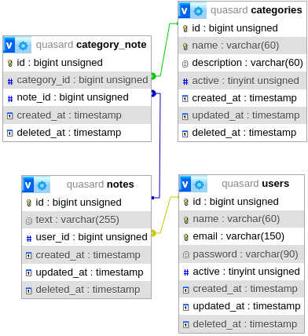

# Simple Symfony API

This is a basis API App using Symfony.
Three entities and their endpoints are used: *users*, *notes* and *categories*.

### How to run the app on development

It's necessary to [install the Symfony CLI](https://symfony.com/download#step-1-install-symfony-cli)
before to **run the local server**.

Run command:

    cd my-project/
    symfony server:start -d

*Add `-d` to run the server in background and continue using the console.*

To stop the server:

    symfony server:stop

Watch last server log (only when the server is running):

    symfony server:log

To **access to the application**:

    http://localhost:8000

***NOTE:** restart the server after every composer.json modification.*

More details on: https://symfony.com/doc/current/setup/symfony_server.html

***

### ER schema

    |-------| 1   N |-------| N   N |------------|
    | users |-------| notes |-------| categories |
    |-------|       |-------|       |------------|

 - The user can have notes.
 - Each note belongs to an user.
 - Each note has one or more categories and each category can have many notes.

### Create DB tables

Use the files from "database/sql" to create the BD tables in this order:

 - create-tables.sql
 - test-inserts.sql
 - constraint-tables.sql

***NOTE:** the inserts are optional, use to check on first place some GET endpoints.*
***NOTE:** the provided SQL was tested on MySQL 8.0.36 on Ubuntu.*

***

### API routes

The available API routes are:

    DELETE | [domain]/api/v1/users/delete/[id]
    GET    | [domain]/api/v1/users
    GET    | [domain]/api/v1/users/find-notes/[id]
    GET    | [domain]/api/v1/users/find-notes/[id]/old
    GET    | [domain]/api/v1/users/find/[id]
    POST   | [domain]/api/v1/users/create
    PUT    | [domain]/api/v1/users/update

    DELETE | [domain]/api/v1/notes/delete/[id]/user/[user_id]
    GET    | [domain]/api/v1/notes/find/[id]
    POST   | [domain]/api/v1/notes/create
    PUT    | [domain]/api/v1/notes/remove-category
    PUT    | [domain]/api/v1/notes/set-category
    PUT    | [domain]/api/v1/notes/update

    DELETE | [domain]/api/v1/categories/delete/[id]
    GET    | [domain]/api/v1/categories
    GET    | [domain]/api/v1/categories/find-notes/[id]
    GET    | [domain]/api/v1/categories/find/[id]
    POST   | [domain]/api/v1/categories/create
    PUT    | [domain]/api/v1/categories/update

***NOTE:** routes added in the controllers as*
*[attributes](https://symfony.com/doc/current/best_practices.html#best-practice-controller-attributes).*

***

### App Directories

    src/
      |
      |-- Controller/
      |     |-- api/
      |
      |-- Exceptions/
      |
      |-- Util/
      |     |-- Helpers/
      |     |     |-- Common/
      |     |
      |     |-- Interfaces/
      |
      |-- Repository/
      |
      |-- Services/
            |-- Common/
            |
            |-- Repository/
                  |-- Common/

***

@author:  Moisés Alcocer, 2024
@license: Apache 2.0
@repo:    https://github.com/oricis/api_quasard
